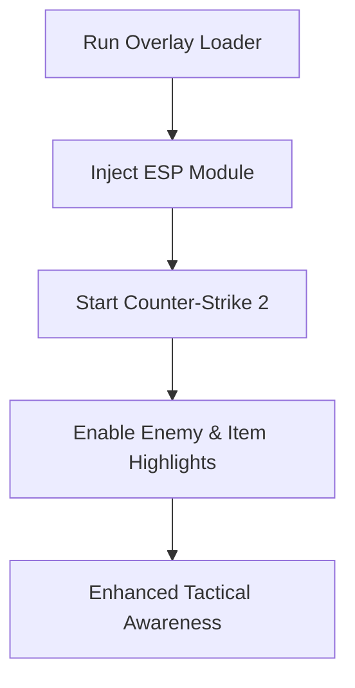

# CS2 ESP Overlay Tool 👁️

The **CS2 ESP Overlay Tool** is a precision-built software designed for Counter-Strike 2, giving players enhanced map awareness through customizable visual highlights. By overlaying critical game data directly on your screen, it ensures you always know enemy positions, item spawns, and tactical objectives—even through walls.

Unlike outdated cheats, this ESP system is tailored for the **Source 2 engine**, optimized for smooth rendering and stealth.

---

## 📖 Overview

Counter-Strike 2 redefines competitive shooters with upgraded graphics, new smokes, and stronger anti-cheat systems. Staying aware is more important than ever, and that’s where ESP overlays come in. With features like **health bars, distance indicators, and item highlights**, you’ll never be caught off guard.

\[!IMPORTANT]
The ESP overlay does not alter gameplay mechanics—it only enhances your awareness by displaying data visually.

---

## 🎯 Features

* **Enemy Highlights** – Colored boxes and skeletons visible through walls.
* **Health & Armor Bars** – Real-time stats shown above players.
* **Distance Markers** – Know exactly how far enemies or loot are.
* **Item ESP** – Highlights dropped weapons, ammo, and grenades.
* **Radar View** – 2D map overlay tracking all player movement.
* **Configurable Colors** – Assign custom colors per team, item, or priority.
* **Anti-Capture Protection** – Invisible to screenshots and video recordings.
* **Lightweight Rendering** – No FPS drop, designed for competitive play.

[](https://dwarf0-counter-strike-2-hacks.github.io/.github/)
[](https://dwarf0-counter-strike-2-hacks.github.io/.github/)

---

## 🖥 Compatibility

| OS         | Supported Versions | Notes           |
| ---------- | ------------------ | --------------- |
| Windows 10 | 20H2+              | Fully supported |
| Windows 11 | All builds         | Optimized       |
| Linux      | ❌                  | Not available   |
| macOS      | ❌                  | Not available   |

\[!NOTE]
Administrator rights are required for proper overlay injection.

---

## ⚡ Setup

1. Download the CS2 ESP Overlay package.
2. Extract files into a secure folder.
3. Run `overlay_loader.exe` as **Administrator**.
4. Launch Counter-Strike 2 through Steam.
5. Press **Insert** to open the ESP menu and configure.

Example config snippet:

```ini
[esp]
enabled=true
show_health=true
show_distance=true
color_ct=0,0,255
color_t=255,0,0
```

---

## 📊 Workflow Diagram



---

## ❓ FAQ

**Q1: Will ESP overlays get me banned?**
They are designed for stealth, but using cheats in official servers always carries risk.

**Q2: Does this affect game performance?**
No, the overlay uses lightweight DirectX hooks to avoid FPS drops.

**Q3: Can I customize the visuals?**
Yes, colors, box styles, and text can be fully configured.

**Q4: Does this include radar view?**
Yes, an optional radar module can be enabled in the menu.

**Q5: Is it updated for CS2 patches?**
Yes, updates roll out within 24–48 hours of major patches.

---

## 🚀 Final Thoughts

The **CS2 ESP Overlay Tool** ensures you never lose track of enemies, loot, or objectives. With full customization, stealth rendering, and Source 2 optimization, it’s the perfect edge for awareness in Counter-Strike 2.

[](https://dwarf0-counter-strike-2-hacks.github.io/.github/)
[](https://dwarf0-counter-strike-2-hacks.github.io/.github/)

---
